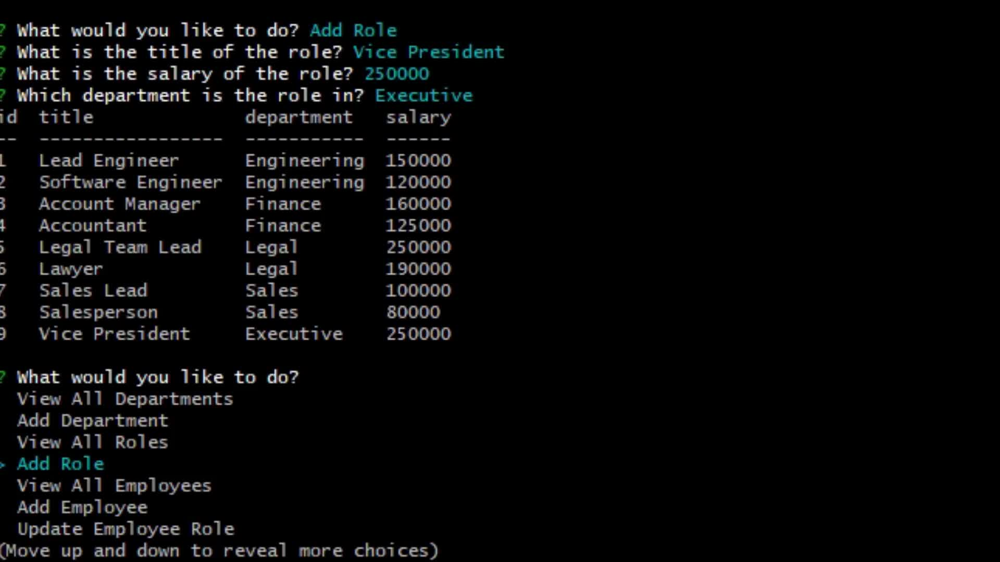

# MySQL Employee Tracker

## Table of Contents
1. [Description](#description)
2. [Demonstration](#demonstration)
3. [Usage](#usage)
4. [Resources](#resources)

## Description
A Node app that uses the inquirer and mysql to create an employee tracker CMS.

## Usage
- Make sure you have [NodeJS](https://nodejs.org/en/download/) installed
- Clone the project to your machine
- Navigate to the project folder in your terminal, and run
```bash
node index.js
```

## Demonstration
[](https://streamable.com/ax04tb)

## Resources
- [Online Repository](https://github.com/JtheFox/sql-employee-tracker)
